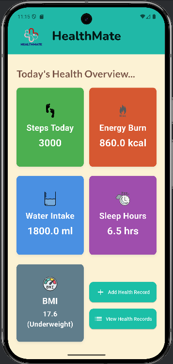
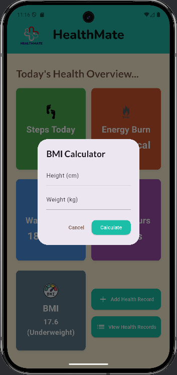
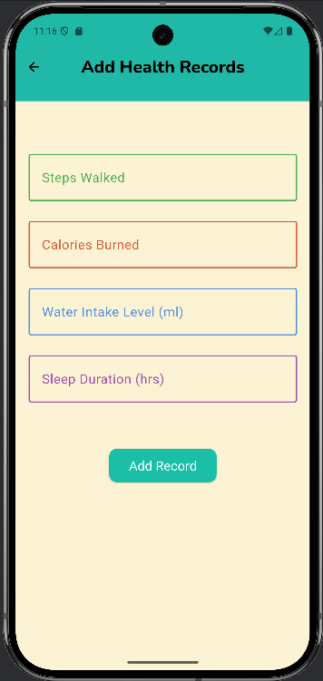
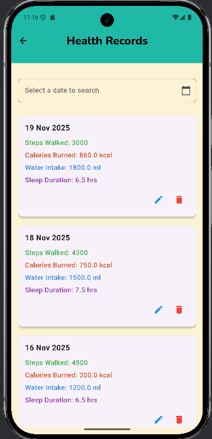
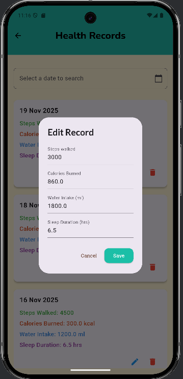

# health_mate

HealthMate is a flutter-based mobile application developed for tracking user's daily health activities including steps walked, calories burned, water intake level, sleep duration and the BMI status.

## features

- Personalized dashboards
- BMI calculator
- Adding new health records
- View a list of all the health records
- Update the records
- Delete records
- Search for records by date

## how the app works

- The users are able to see a summary of their day-to-day activities on the dashboard. 
- Users can calculate their BMI values by entering height and the weight.
- the dashboard page will navigate users to another two pages, which are 'add new record' and 'view health records'.
- In the add new record page - users can enter values for each activity category and save the record. it will appear on the dashboard.
- In the view health records page - users can see a list of all the past records, filter records by search for date, edit record information and delete records.
- To update any record, an edit modal will be displayed. users can enter new values and save them, so the list will be updated.
- Record deletion will be done after accepting the confirmation. and the deleted record will be removed from the list.

## technologies used
- Flutter as the main framework
- Android Studio as the code editor and to run the app
- Dart as the programming language
- Git and GitHub as the version control

## User Interfaces
- 
- 
- 
- 
- 

